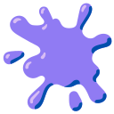
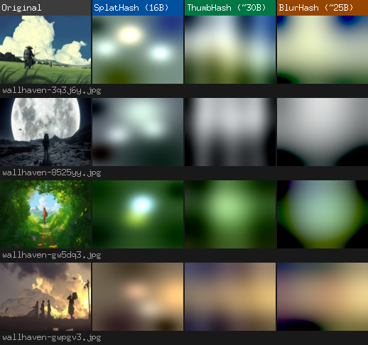

<div align="center">


**compress any image to 16 bytes — and reconstruct it**

[**Algorithm**](./ALGORITHM.md) | [**Report Bugs**](https://github.com/junevm/splathash/issues) | [**Contributing**](#contributing)

</div>

**SplatHash** is a perceptual image hashing algorithm that fits a meaningful visual representation of any image into exactly 16 bytes. Encode a photo — get back a tiny hash. Decode the hash — get back a blurry 32x32 preview that captures the color structure of the original.

## Why SplatHash?

- **Fixed 16 bytes**: BlurHash outputs 25–35 bytes minimum. ThumbHash is variable-length at 25–35 bytes typical. SplatHash is always 16 bytes — storable as a single 128-bit integer, zero overhead.
- **Localized basis functions**: BlurHash and ThumbHash use cosine (frequency) basis functions that are global — a feature in one corner pollutes the entire representation. SplatHash uses Gaussian blobs that are spatially localized. A bright spot in the top-left doesn't interfere with the bottom-right.
- **Global optimization**: After finding splat positions greedily, SplatHash runs Ridge Regression across all splats simultaneously to find the best possible combination of weights. No other 16-byte algorithm does this.
- **Perceptually uniform color**: All computation happens in Oklab, a color space where equal numerical differences correspond to equal perceived differences. Minimizing error in Oklab means minimizing the right thing.
- **Deterministic and cross-language**: The same image produces the same hash in Go, TypeScript (Node and browser), and Python. Bit-for-bit identical.

## How It Works

SplatHash describes an image as a background color plus six soft Gaussian blobs (Splats) layered on top:

- **3 Baryons** — full-color Splats for the dominant features
- **3 Leptons** — luma-only Splats for texture and detail

The position and size of each Splat is found by a greedy search. Then Ridge Regression refines the color weights of all six Splats together, so they cooperate rather than fight each other.

The result is packed into 128 bits and decoded as a 32x32 RGBA image.

For the full technical explanation, see [ALGORITHM.md](./ALGORITHM.md).

## Visual Comparison

The image below shows SplatHash, ThumbHash, and BlurHash reconstructions side by side for the same input images. All three algorithms produce a low-resolution preview — SplatHash always fits into exactly 16 bytes.



*Columns: original (downscaled), SplatHash decode (32×32), ThumbHash decode, BlurHash decode. Regenerate with `mise run compare`.*

## Implementations

SplatHash has a **first-class Go implementation** (the reference) and **second-class implementations** for TypeScript (Node and browser) and Python. All implementations are tested against the same image assets and produce identical hashes.

| Language                 | Location    | Status       | Notes                                |
| :----------------------- | :---------- | :----------- | :----------------------------------- |
| **Go**                   | `src/go/`   | First-class  | Reference implementation             |
| **TypeScript (Node)**    | `src/ts/`   | Second-class | Isomorphic, also runs in browsers    |
| **TypeScript (Browser)** | `src/ts/`   | Second-class | Same package, no extra config needed |
| **Python**               | `src/py/`   | Second-class | Requires Pillow                      |

## Installation

### Go

```bash
go get github.com/junevm/splathash/src/go
```

```go
import "github.com/junevm/splathash/src/go"

hash := splathash.EncodeImage(img)      // []byte, 16 bytes
img, err := splathash.DecodeImage(hash) // image.Image, 32x32
```

See [`src/go/README.md`](./src/go/README.md) and `src/go/examples/simple/main.go` for full examples.

### TypeScript / Node.js

```bash
npm install splathash
```

```typescript
import { encode, decode } from "splathash";

// Encode from raw RGBA bytes
const hash = encode(rgba, width, height); // Uint8Array, 16 bytes

// Decode to 32x32 RGBA
const result = decode(hash);
// result.rgba is a Uint8ClampedArray
```

See [`src/ts/README.md`](./src/ts/README.md) and `src/ts/examples/simple.ts` for full examples using `sharp`.

### TypeScript / Browser
Same package. Pass raw RGBA data from a `<canvas>` context:

```typescript
import { encode, decode } from "splathash";

const ctx = canvas.getContext("2d");
const { data } = ctx.getImageData(0, 0, canvas.width, canvas.height);
const hash = encode(data, canvas.width, canvas.height);
```

### Python

```bash
pip install splathash
```

```python
from splathash import encode, decode

with open("image.jpg", "rb") as f:
    hash_bytes = encode(f)   # bytes, 16 bytes

# Or encode from raw RGBA
hash_bytes = encode_raw(rgba_bytes, width, height)

# Decode to 32x32 RGBA
pixels = decode(hash_bytes)  # bytes, 32*32*4
```

See [`src/py/README.md`](./src/py/README.md) and `src/py/example.py` for a full working example.

## Development

Use [mise](https://mise.jdx.dev/) to manage tool versions and run tasks:

```bash
mise install          # Install Go and Node at correct versions
```

### Running Tests

```bash
# All implementations
mise run test

# Go only
mise run test:go

# TypeScript only
mise run test:ts

# Python only
mise run test:py
```

### Benchmarks (Go)

```bash
mise run bench
```

### Visual Comparison

Generate an HTML file comparing SplatHash against BlurHash and ThumbHash:

```bash
mise run compare
```

## Contributing

See [CONTRIBUTING.md](./CONTRIBUTING.md).

## License

See [LICENSE](./LICENSE).
